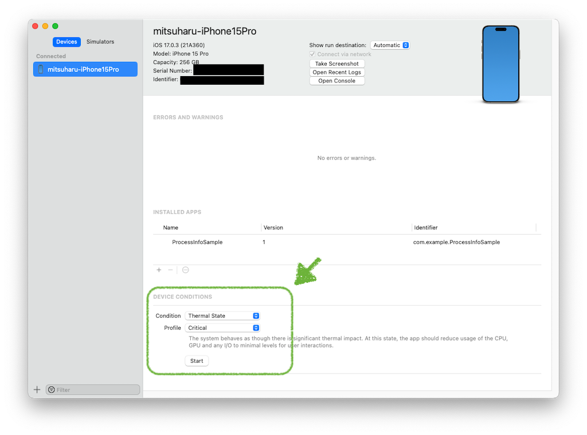

ThermalMonitorSample
==

It is monitoring thermal state of iPhone.

## Support

- Thermal state
- Low power mode
- AVChaotureDevice

## Simulate thermal state for debug

Xcode > Window > "Devices and Simulators"

